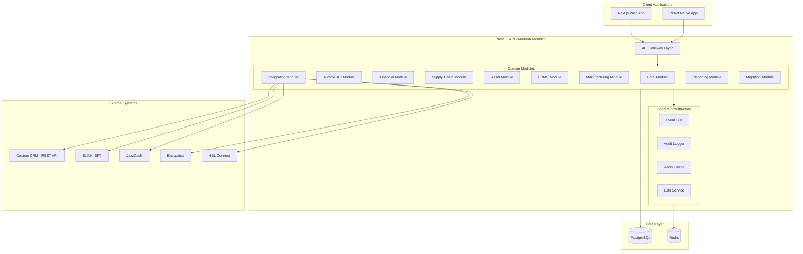
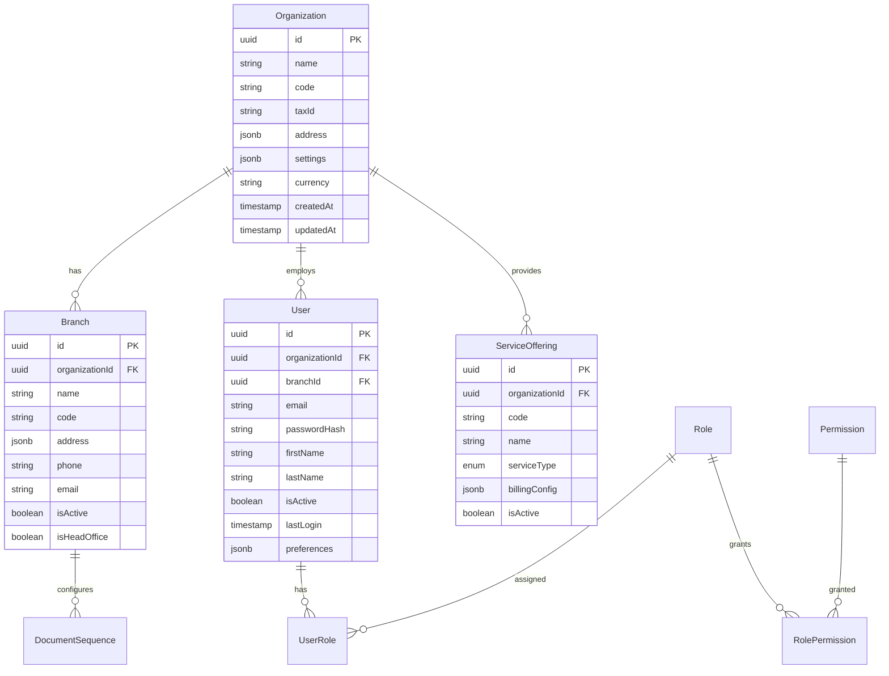
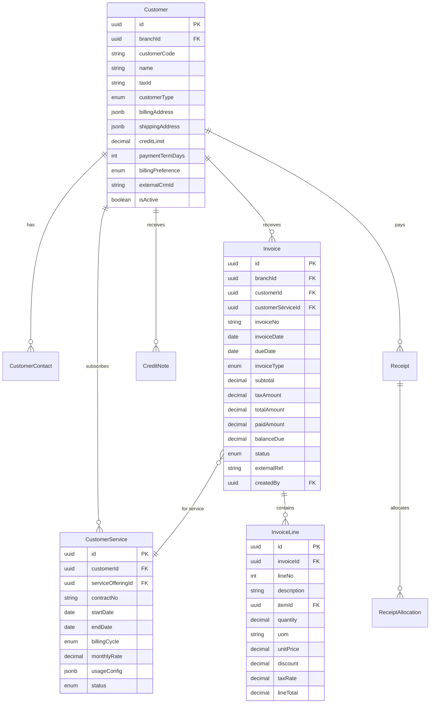
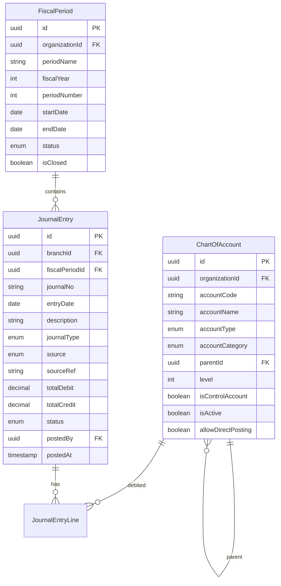
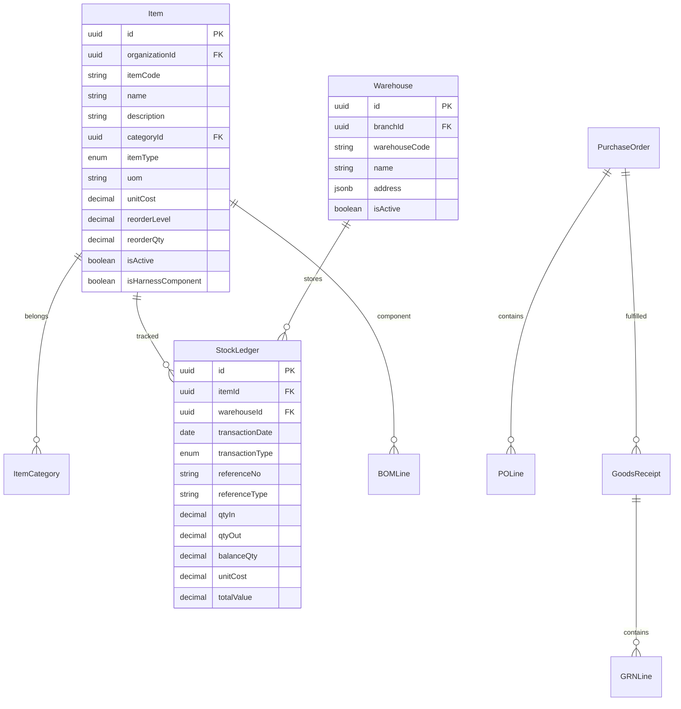
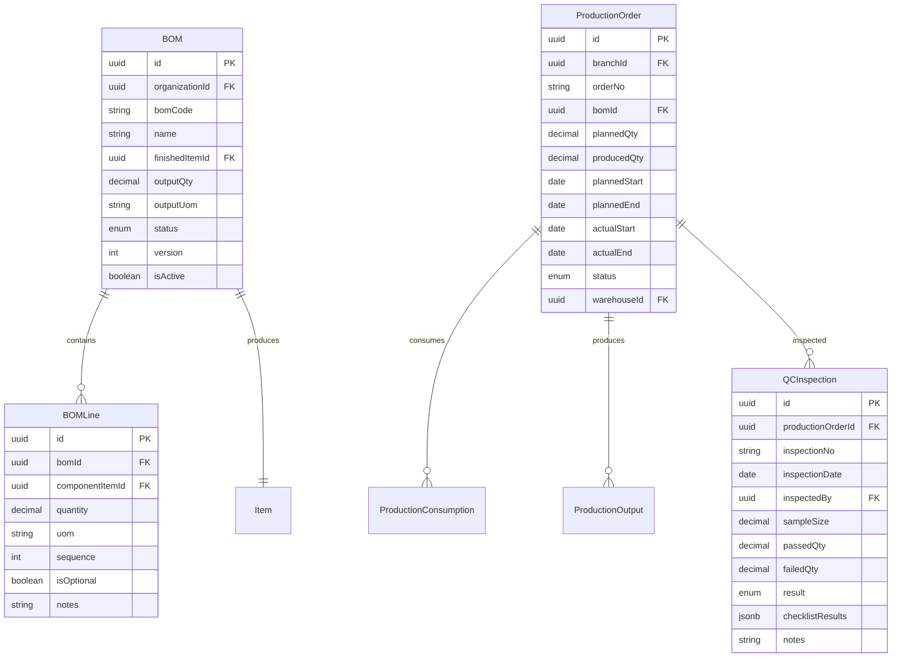
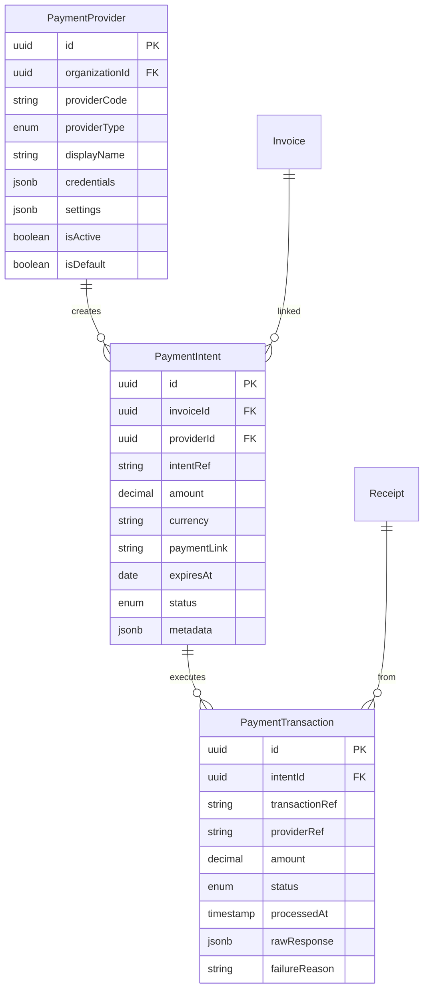
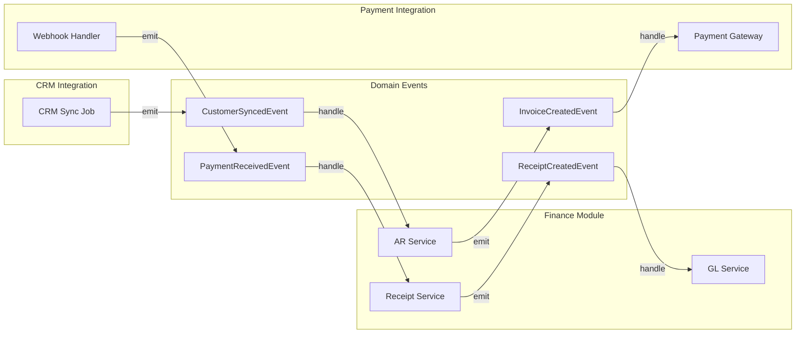
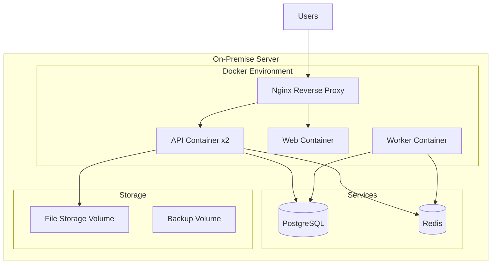

# iTeck ERP - Modular Monolithic Architecture Plan

## Business Context Summary

**Company:** iTecknologi Tracking Services (Pvt) Ltd

**Business Lines:**

- Asset Tracking Services (device sales + monitoring fees)
- Fleet Management Solutions (SaaS + hardware)
- Hardware/Device Sales (one-time purchases)
- Installation & Maintenance Services
- Software Licensing / White-label Solutions

**Current Pain Points:**

- Desktop-only accounting system
- Office-premises restricted operation
- Heavy manual billing (~4,500-5,000 invoices/month)
- Manual receipt generation (~1,500 receipts/month)
- Missing: Inventory/SCM, HRMS, Asset Management, BI/Reporting

**Target State:**

- Web-based ERP + Mobile App
- Automated billing via CRM integration
- Payment collection via 1LINK, JazzCash, Easypaisa, HBL
- BI dashboards for management reporting

## Architecture Overview



## 1. Monorepo Structure

```
fin_teck/
├── apps/
│   ├── api/                        # NestJS Backend
│   │   ├── src/
│   │   │   ├── modules/
│   │   │   │   ├── core/           # Organization, Branch, Settings, Services
│   │   │   │   ├── auth/           # Authentication, RBAC, Users
│   │   │   │   ├── finance/        # AR, AP, GL, Cash, Budget
│   │   │   │   │   ├── ar/         # Accounts Receivable
│   │   │   │   │   ├── ap/         # Accounts Payable
│   │   │   │   │   ├── gl/         # General Ledger
│   │   │   │   │   ├── cash/       # Cash & Bank Management
│   │   │   │   │   └── budget/     # Budgeting & Forecasting
│   │   │   │   ├── scm/            # Supply Chain Management
│   │   │   │   │   ├── inventory/  # Items, Stock Ledger
│   │   │   │   │   ├── procurement/# PR, PO, GRN
│   │   │   │   │   └── distribution/# Stock Transfers, Delivery
│   │   │   │   ├── asset/          # Asset Management
│   │   │   │   ├── hrms/           # HR, Payroll, Performance
│   │   │   │   ├── manufacturing/  # BOM, WIP, QC (Wiring Harness)
│   │   │   │   ├── integration/    # External System Adapters
│   │   │   │   │   ├── crm/        # Custom CRM adapter
│   │   │   │   │   └── payment/    # Payment gateway adapters
│   │   │   │   ├── reporting/      # BI & Dashboard endpoints
│   │   │   │   └── migration/      # Data migration tools
│   │   │   ├── shared/             # Common infrastructure
│   │   │   │   ├── database/       # Prisma service, transactions
│   │   │   │   ├── events/         # Event bus, domain events
│   │   │   │   ├── audit/          # Audit logging
│   │   │   │   ├── guards/         # Auth guards
│   │   │   │   ├── interceptors/   # Logging, transform
│   │   │   │   ├── decorators/     # Custom decorators
│   │   │   │   └── i18n/           # Internationalization (Urdu ready)
│   │   │   └── main.ts
│   │   ├── prisma/
│   │   │   ├── schema.prisma       # Full schema
│   │   │   ├── migrations/
│   │   │   └── seed.ts
│   │   └── test/
│   ├── web/                        # Next.js Frontend
│   │   ├── src/
│   │   │   ├── app/                # App Router pages
│   │   │   ├── components/         # UI components
│   │   │   │   ├── ui/             # shadcn/ui primitives
│   │   │   │   ├── forms/          # Form components
│   │   │   │   ├── tables/         # Data tables
│   │   │   │   └── layout/         # Layout components
│   │   │   ├── lib/                # Utilities
│   │   │   ├── hooks/              # Custom hooks
│   │   │   └── i18n/               # Translation files
│   │   └── public/
│   └── mobile/                     # React Native (scaffold)
│       └── src/
├── packages/
│   └── shared/                     # Shared types, DTOs, validation
│       ├── src/
│       │   ├── types/              # TypeScript interfaces
│       │   ├── dto/                # Data Transfer Objects
│       │   ├── validation/         # Zod schemas
│       │   ├── constants/          # Enums, constants
│       │   └── utils/              # Shared utilities
│       └── package.json
├── docker/
│   ├── docker-compose.yml          # Production compose
│   ├── docker-compose.dev.yml      # Development compose
│   ├── Dockerfile.api              # API container
│   ├── Dockerfile.web              # Web container
│   └── nginx/                      # Reverse proxy config
├── docs/
│   ├── api/                        # OpenAPI specs
│   ├── architecture/               # Architecture diagrams
│   └── migration/                  # Data migration guides
├── scripts/
│   ├── setup.sh                    # Initial setup
│   ├── migrate.sh                  # Run migrations
│   ├── seed.sh                     # Seed data
│   └── backup.sh                   # Database backup
├── package.json                    # Workspace root
├── turbo.json                      # Turborepo config
├── .env.example                    # Environment template
└── README.md
```

## 2. Database Schema Design

Using **Prisma** with **schema-per-module** approach (PostgreSQL schemas).

### Core Entities



### Finance Module - AR Entities



### Finance Module - GL Entities



### Supply Chain Entities



### Manufacturing Entities (Wiring Harness)



### Payment Integration Entities



### Key Schema Decisions

| Aspect | Decision | Rationale |

|--------|----------|-----------|

| ORM | Prisma | Type-safe, great migrations, modern DX |

| Multi-tenancy | Organization + Branch columns | Single DB, future multi-tenant ready |

| Soft deletes | `deletedAt` column on key entities | Audit trail, data recovery |

| Document numbers | `DocumentSequence` table | Configurable per branch/module (INV-2026-0001) |

| Money fields | `Decimal(19,4)` | Financial precision for PKR |

| Audit fields | `createdAt, updatedAt, createdBy, updatedBy` | All transactional entities |

| External refs | `externalRef` + `sourceSystem` | Idempotency for CRM/payment sync |

| Billing config | `billingPreference` enum | Per-customer: unified vs separate invoices |

## 3. Module Implementation Details

### Auth/RBAC Module

- JWT access tokens (15min) + refresh tokens (7 days, stored in DB)
- Password hashing with bcrypt (12 rounds)
- Password policy: min 8 chars, uppercase, lowercase, number
- Rate limiting on auth endpoints (5 requests/minute)
- Permissions format: `module:entity:action` (e.g., `finance:invoice:create`)
- Session management with device tracking

**Predefined Roles:**

| Role | Description | Key Permissions |

|------|-------------|-----------------|

| Admin | Full system access | All permissions |

| FinanceUser | AR/AP/GL operations | `finance:*:*` |

| SupplyChainUser | Inventory/Procurement | `scm:*:*` |

| HRUser | HRMS operations | `hrms:*:*` |

| AssetManager | Asset lifecycle | `asset:*:*` |

| ManufacturingUser | Production/QC | `manufacturing:*:*` |

| Manager | View + approve | `*:*:read`, `*:*:approve` |

| Viewer | Read-only access | `*:*:read` |

### Finance Module Sub-modules

**AR (Accounts Receivable):**

- Customer master with CRM sync (`externalCrmId`)
- Service subscriptions per customer (tracks Fleet Mgmt, Asset Tracking, etc.)
- Invoice generation (manual + automated from CRM)
- Credit Notes with reason codes
- Receipts with multi-invoice allocation
- Aging reports (Current, 30, 60, 90, 120+ days)
- Dunning letters (templates per aging bucket)

**Billing Configuration (per Customer):**

```typescript
enum BillingPreference {
  UNIFIED = 'UNIFIED',           // Single invoice for all services
  PER_SERVICE = 'PER_SERVICE',   // Separate invoice per service type
  PER_CONTRACT = 'PER_CONTRACT'  // Separate invoice per contract
}
```

**AP (Accounts Payable):**

- Vendor master
- Bills from PO/GRN or direct
- Bill payments with bank selection
- Aging reports

**GL (General Ledger):**

- Chart of Accounts (hierarchical, 4-level)
- Fiscal periods with open/closed status
- Journal entries (manual + system-generated)
- Posting rules by transaction type
- Trial balance, P&L, Balance Sheet endpoints

**Cash/Bank:**

- Bank account register
- Transactions (deposits, withdrawals, transfers)
- Reconciliation worksheet

### Integration Module

**CRM Adapter Interface:**

```typescript
interface ICRMAdapter {
  // Customer sync
  fetchCustomers(since?: Date): Promise<CRMCustomer[]>;
  fetchContracts(customerId: string): Promise<CRMContract[]>;
  
  // Usage-based billing
  fetchUsageEvents(contractId: string, period: DateRange): Promise<UsageEvent[]>;
  
  // Status sync
  updateInvoiceStatus(invoiceId: string, status: string): Promise<void>;
}

// Billing types for different services
enum UsageEventType {
  TRACKING_DAYS = 'TRACKING_DAYS',      // Asset tracking per device-day
  FLEET_VEHICLES = 'FLEET_VEHICLES',    // Fleet mgmt per vehicle
  API_CALLS = 'API_CALLS',              // White-label API usage
  INSTALLATION = 'INSTALLATION',        // One-time installation
  MAINTENANCE = 'MAINTENANCE'           // Service calls
}
```

**Payment Gateway Adapters:**

```typescript
interface IPaymentGateway {
  providerCode: PaymentProviderCode;
  
  // Payment link generation
  createPaymentIntent(invoice: Invoice): Promise<PaymentIntent>;
  
  // Status check
  getPaymentStatus(intentRef: string): Promise<PaymentStatus>;
  
  // Webhook handling
  verifyWebhookSignature(payload: string, signature: string): boolean;
  parseWebhookPayload(payload: string): WebhookEvent;
}

enum PaymentProviderCode {
  ONELINK_IBFT = '1LINK',
  JAZZCASH = 'JAZZCASH',
  EASYPAISA = 'EASYPAISA',
  HBL_CONNECT = 'HBL'
}
```

### Cross-Module Communication



## 4. Frontend Architecture

### Tech Stack

- **Framework:** Next.js 14 with App Router
- **Styling:** Tailwind CSS + shadcn/ui components
- **State:** React Query (server) + Zustand (client)
- **Forms:** React Hook Form + Zod validation
- **i18n:** next-intl (English now, Urdu-ready)
- **Charts:** Recharts (for dashboards)

### UI Design Direction

- Clean, professional aesthetic suitable for ERP
- Consistent spacing and typography
- Data-dense tables with good scannability
- Form validation with clear error messages
- Responsive for tablet use (field technicians)

### Page Structure

```
/                               # Dashboard with KPI cards
├── /auth/
│   ├── login                   # Login page
│   ├── forgot-password         # Password reset request
│   └── reset-password          # Password reset form
├── /finance/
│   ├── /customers              # Customer list + CRUD
│   │   └── /[id]               # Customer detail + services
│   ├── /invoices               # Invoice list
│   │   ├── /new                # Create invoice
│   │   ├── /[id]               # Invoice detail
│   │   └── /[id]/payment-link  # Generate payment link
│   ├── /credit-notes           # Credit note list + CRUD
│   ├── /receipts               # Receipt list
│   │   └── /new                # Create receipt (manual)
│   ├── /vendors                # Vendor list + CRUD
│   ├── /bills                  # Bill list + CRUD
│   ├── /gl/
│   │   ├── accounts            # Chart of accounts
│   │   ├── journals            # Journal entries
│   │   └── periods             # Fiscal period management
│   └── /reports/
│       ├── aging               # AR aging report
│       ├── trial-balance       # Trial balance
│       └── pnl                 # Profit & Loss
├── /scm/
│   ├── /items                  # Item master
│   ├── /warehouses             # Warehouse setup
│   ├── /inventory              # Stock ledger view
│   ├── /purchase-requisitions  # PR list + create
│   ├── /purchase-orders        # PO list + create
│   ├── /grn                    # Goods receipt
│   └── /transfers              # Stock transfers
├── /hrms/
│   ├── /employees              # Employee master
│   ├── /payroll                # Pay runs
│   │   └── /[id]               # Payroll detail + payslips
│   └── /performance            # KPI evaluations
├── /assets/
│   ├── /register               # Asset register
│   ├── /categories             # Asset categories
│   ├── /depreciation           # Depreciation runs
│   └── /maintenance            # Maintenance records
├── /manufacturing/
│   ├── /bom                    # Bill of materials
│   ├── /production-orders      # Work orders
│   └── /qc                     # QC inspections
├── /integrations/
│   ├── /crm                    # CRM sync status
│   └── /payments               # Payment provider status
└── /settings/
    ├── /organization           # Org settings
    ├── /branches               # Branch management
    ├── /users                  # User management
    ├── /roles                  # Role management
    └── /sequences              # Document numbering
```

## 5. On-Premise Deployment Architecture



**Docker Compose Services:**

- `api` - NestJS application (2 replicas for availability)
- `web` - Next.js frontend (SSR)
- `worker` - Background job processor (CRM sync, billing jobs)
- `postgres` - PostgreSQL 15+
- `redis` - Redis 7+ (caching, queues)
- `nginx` - Reverse proxy, SSL termination

**Resource Requirements (20-50 users):**

- CPU: 8 cores
- RAM: 32GB
- Storage: 500GB SSD (expandable)
- Network: 100Mbps dedicated

## 6. Data Migration Strategy

Since you have existing data from the desktop accounting system:

**Migration Module Features:**

1. **Import Templates:** Excel/CSV templates for each entity type
2. **Validation:** Pre-import validation with error reports
3. **Staging:** Import to staging tables first
4. **Transformation:** Data mapping and transformation rules
5. **Execution:** Batch import with transaction support
6. **Rollback:** Ability to rollback failed migrations

**Migration Sequence:**

1. Chart of Accounts
2. Customers & Vendors
3. Items & Inventory balances
4. Opening balances (AR, AP, GL)
5. Employees
6. Assets

## 7. Implementation Iterations

### Iteration 1: Foundations (Current Scope)

**Backend:**

- Monorepo setup with Turborepo + pnpm
- Docker Compose (PostgreSQL, Redis)
- NestJS API structure
- Prisma schema (Core + Auth entities)
- Auth module (JWT, refresh tokens)
- RBAC module (roles, permissions, guards)
- Core module (Organization, Branch, Settings)
- Audit logging interceptor
- Swagger/OpenAPI documentation
- Seed data (admin user, roles)

**Frontend:**

- Next.js app with App Router
- Auth pages (login, forgot password)
- Dashboard layout with sidebar
- Placeholder pages for all modules
- API client setup with React Query

### Iteration 2: Finance MVP

- Customer master with CRM fields
- Service subscriptions
- Invoice CRUD with line items
- Credit notes
- Receipts with allocations
- Chart of Accounts
- Basic journal posting
- Payment gateway adapters (mock first)
- AR aging report

### Iteration 3: Supply Chain

- Item master with categories
- Warehouse management
- Stock ledger (movements)
- Purchase requisitions
- Purchase orders
- Goods receipt notes (GRN)
- Stock transfers
- Reorder alerts

### Iteration 4: HRMS + Assets

- Employee master
- Salary components
- Payroll runs + payslips
- Asset register
- Asset categories
- Depreciation methods + runs
- Asset lifecycle (transfer, dispose)

### Iteration 5: Manufacturing

- BOM for wiring harness
- Production orders
- Component consumption
- Finished goods output
- QC inspections

### Iteration 6: Integration + BI

- CRM adapter implementation
- Payment gateway implementations (1LINK, JazzCash, Easypaisa, HBL)
- Automated billing jobs
- Dashboard KPIs
- Reporting endpoints
- Data migration tools
- Performance optimization

## 8. Key Files (Iteration 1)

| File | Purpose |

|------|---------|

| `apps/api/src/modules/core/core.module.ts` | Organization, Branch, Settings, Services |

| `apps/api/src/modules/auth/auth.module.ts` | Auth, Users, Sessions |

| `apps/api/src/modules/auth/rbac/rbac.module.ts` | Roles, Permissions |

| `apps/api/src/shared/guards/jwt-auth.guard.ts` | JWT authentication |

| `apps/api/src/shared/guards/permissions.guard.ts` | Permission-based authorization |

| `apps/api/src/shared/interceptors/audit.interceptor.ts` | Audit logging |

| `apps/api/src/shared/interceptors/correlation.interceptor.ts` | Request correlation IDs |

| `apps/api/prisma/schema.prisma` | Complete database schema |

| `apps/api/prisma/seed.ts` | Seed data script |

| `apps/web/src/app/layout.tsx` | Root layout with providers |

| `apps/web/src/app/(auth)/login/page.tsx` | Login page |

| `apps/web/src/app/(dashboard)/layout.tsx` | Dashboard layout |

| `apps/web/src/components/layout/sidebar.tsx` | Navigation sidebar |

| `packages/shared/src/types/index.ts` | Shared TypeScript interfaces |

| `packages/shared/src/dto/auth.dto.ts` | Auth DTOs |

| `docker/docker-compose.yml` | Production compose |

| `docker/docker-compose.dev.yml` | Development compose |

## 9. Running Locally

```bash
# Clone and install
git clone <repo>
cd fin_teck
pnpm install

# Start infrastructure
docker compose -f docker/docker-compose.dev.yml up -d

# Setup database
cd apps/api
pnpm prisma migrate dev
pnpm prisma db seed

# Start API
pnpm dev

# In another terminal - Start Web
cd apps/web
pnpm dev

# Access points
# API: http://localhost:3001/api
# Swagger: http://localhost:3001/api/docs
# Web: http://localhost:3000

# Default admin login
# Email: admin@iteck.pk
# Password: Admin@123!
```

## 10. Confirmed Requirements

| Requirement | Decision |

|-------------|----------|

| Business model | Multi-service: Asset Tracking, Fleet Mgmt, Device Sales, Installation, Software Licensing |

| Billing model | Configurable per customer (unified/per-service/per-contract) |

| CRM integration | Custom CRM with REST/JSON API (specs to be provided) |

| Payment gateways | 1LINK IBFT, JazzCash, Easypaisa, HBL Connect |

| Manufacturing | Wiring harness assembly for tracking devices |

| Deployment | On-premise with Docker |

| Users | 20-50 concurrent users |

| Data migration | Required from existing desktop system |

| Language | English now, Urdu/RTL support later |

| Currency | PKR (single currency for now) |