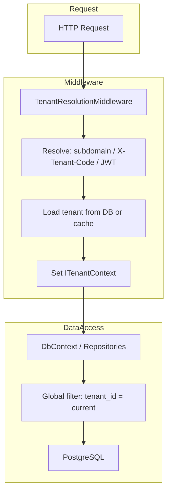
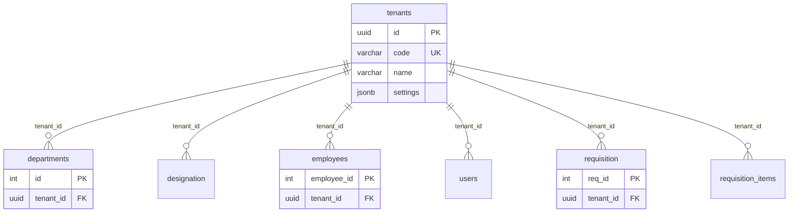

# Multi-Tenant Architecture Design

**Strategy**: Shared database with **TenantId column** (recommended for most SaaS). Single connection string; every tenant-scoped table has `tenant_id UUID NOT NULL REFERENCES tenants(id)`.

---

## 1. Strategy Choice

| Strategy | Pros | Cons | Use When |
|----------|------|------|----------|
| **Shared DB, TenantId column** | Simple ops, one connection string, easy backup | Must enforce TenantId on every query; risk of cross-tenant leak if filter missed | **Default** for iteck_erp |
| Schema per tenant | Strong isolation, per-tenant restore | Complex migrations, schema proliferation | Compliance requires schema-level isolation |
| Database per tenant | Maximum isolation | High cost, many connections | Small tenant count or strict compliance |

---

## 2. Tenant Registry and Schema

### Master table: `tenants`

| Column | Type | Description |
|--------|------|-------------|
| id | UUID PK | Primary key |
| code | VARCHAR(50) UNIQUE | Tenant code (e.g. `ACME`) |
| name | VARCHAR(200) | Display name |
| subdomain | VARCHAR(100) | Optional subdomain (e.g. `acme.yourapp.com`) |
| database_name | VARCHAR(100) | Reserved for DB-per-tenant |
| schema_name | VARCHAR(100) | Reserved for schema-per-tenant |
| is_active | BOOLEAN | Whether tenant can access the app |
| settings | JSONB | Per-tenant config (feature flags, limits) |
| created_at, updated_at | TIMESTAMP | Audit |

### Tenant-scoped tables

Each tenant-scoped table has:

- `tenant_id UUID NOT NULL REFERENCES tenants(id)` (after backfill)
- Composite indexes: `(tenant_id, <main_access_column>)` for performance

**Tables**: `departments`, `designation`, `employees`, `users`, `leave_balance`, `requisition`, `requisition_items`.

**Not tenant-scoped**: `tenants`, `employee_type` (shared lookup).

---

## 3. Row-Level Security (RLS)

Optional safeguard in PostgreSQL:

- `ALTER TABLE <table> ENABLE ROW LEVEL SECURITY`
- Policy: `USING (tenant_id = current_setting('app.current_tenant_id', true)::uuid)`
- Application sets `SET app.current_tenant_id = '<uuid>'` per connection/request (e.g. in Npgsql command interceptor or when opening connection).

During migration, policy can allow `tenant_id IS NULL` so existing rows remain visible until backfill is done.

---

## 4. Tenant Resolution (Application Layer)

### Flow

```
Request → TenantResolutionMiddleware → Resolve tenant (subdomain / header / JWT)
       → Load tenant from DB (with cache) → Set ITenantContext (e.g. HttpContext / AsyncLocal)
       → DbContext / Repositories use tenant id (global query filter or SET app.current_tenant_id)
```

### Resolution methods

| Method | Example | Use |
|--------|---------|-----|
| **Subdomain** | `acme.yourapp.com` → tenant code `ACME` | SaaS with custom subdomains |
| **Header** | `X-Tenant-Code: ACME` or `X-Tenant-Id: <uuid>` | APIs, same-domain SPA |
| **JWT claim** | `tenant_id` or `tenant_code` in token | Authenticated API |

### Dynamic behavior (shared DB + TenantId)

- Single connection string.
- Per request: set `app.current_tenant_id` (e.g. Npgsql connection open or command interceptor).
- EF Core: **global query filter** so every query gets `WHERE tenant_id = @current`.
- Dapper / raw SQL: always include `tenant_id` in WHERE and INSERT/UPDATE.

---

## 5. Diagram: Tenant Resolution and Data Access



---

## 6. Diagram: Schema and Tables



---

## 7. Caching and Configuration

- **Tenant metadata**: Cache by `code` or `id` (e.g. IMemoryCache key `tenant:{code}`). Invalidate on tenant update.
- **Per-tenant settings**: Read from `tenants.settings` (JSONB) or separate config store; resolve via `ITenantContext` in app code.

---

## 8. DDL and Run Order

1. Run `00-iteck_erp-init.sql`, `01-iteck_erp-employees.sql`, `02-iteck_erp-requisition.sql`.
2. Run `03-iteck_erp-multitenant.sql` (adds `tenants`, `tenant_id` columns, indexes, optional RLS).
3. Insert default tenant(s); backfill `tenant_id` on existing rows; then `ALTER COLUMN tenant_id SET NOT NULL` if desired.

See `Database/03-iteck_erp-multitenant.sql` for full DDL.
